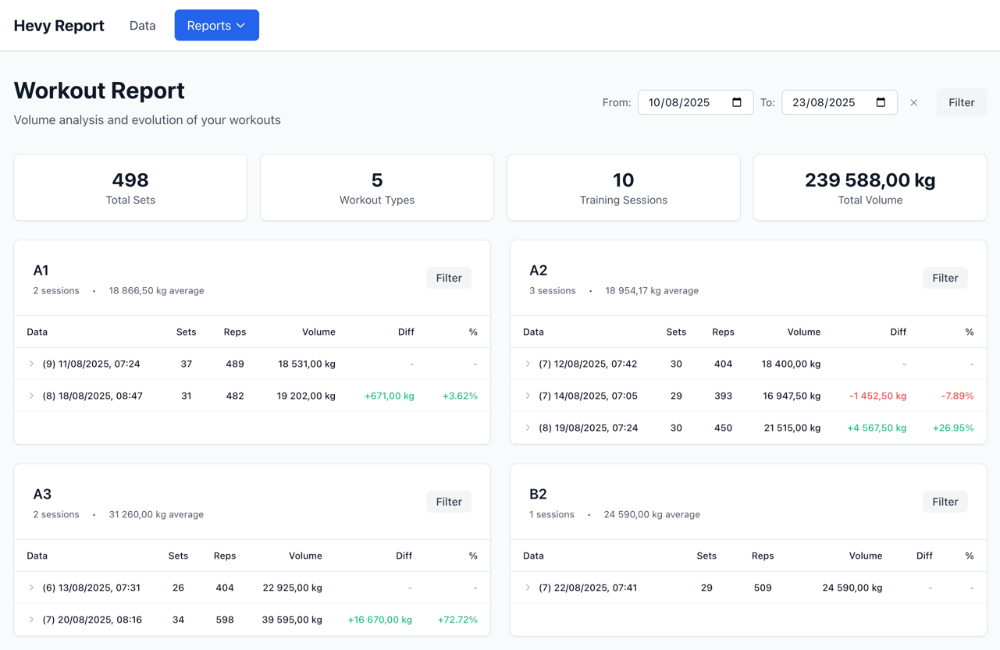

# Hevy Report



A modern web application for analyzing and tracking strength training workouts from **Hevy** app exported data.

## 📋 Features

- **CSV data import** from Hevy with drag & drop interface
- **Comprehensive workout reports** with volume metrics and analytics
- **Advanced filtering system** with exercise and date range filters
- **Percentage difference calculations** between training sessions
- **Card-based visualization** organized by workout type
- **Light mode interface** responsive and print-friendly
- **Local data persistence** with IndexedDB
- **Flexible pagination** with customizable page sizes
- **Toggle-based UI controls** for clean interface management

## 🚀 Technologies

- **React 18** + **TypeScript**
- **Vite** as build tool
- **Tailwind CSS** for styling
- **Zustand** for state management
- **Dexie.js** for IndexedDB
- **Papa Parse** for CSV processing
- **React Router** for navigation

## 📦 Installation

1. **Clone the repository:**
```bash
git clone <repository-url>
cd hevy-report
```

2. **Install dependencies:**
```bash
npm install
```

3. **Run the project in development mode:**
```bash
npm run dev
```

4. **Access the application:**
Open [http://localhost:5173](http://localhost:5173) in your browser.

## 🌐 Live Demo

The application is automatically deployed to GitHub Pages:
**[https://zabaala.github.io/hevy-report/](https://zabaala.github.io/hevy-report/)**

### 🚀 Deploy to GitHub Pages

This project is configured for automatic deployment to GitHub Pages using GitHub Actions:

1. **Fork this repository** to your GitHub account
2. **Enable GitHub Pages** in repository settings:
   - Go to Settings → Pages
   - Source: "GitHub Actions"
3. **Push to main branch** - deployment happens automatically
4. **Access your deployment** at `https://zabaala.github.io/hevy-report/`

The deployment workflow:
- Builds the project with Vite
- Configures proper base paths for GitHub Pages
- Handles SPA routing with 404.html fallback
- Deploys to `gh-pages` branch automatically

## 📖 How to Use

### 1. Export data from Hevy

1. Open the Hevy app on your device
2. Go to **Settings** → **Export data**
3. Select **CSV** format
4. Download the `HEVY-workouts.csv` file

### 2. Import data into the application

1. Access the **Data** page
2. Click the **Import** toggle button to show the import section
3. Drag and drop the CSV file into the designated area or click to select
4. Wait for processing (a progress bar will be displayed)
5. After import, view the data in the preview table with flexible pagination

### 3. View workout reports

1. Access **Reports** → **Workouts** page
2. Use the **date range filter** (From/To) to analyze specific periods
3. Toggle the **Filter** button to show/hide workout type filters
4. View cards organized by workout type (alphabetical order)
5. Use exercise filters within each card for specific analyses
6. Observe volume metrics and percentage differences between sessions

### 4. Advanced features

- **Persistent filters**: Your exercise selections are automatically saved
- **Date range filtering**: Analyze workouts within specific time periods
- **Flexible pagination**: Choose page sizes (5, 10, 25, 50, 100 records)
- **Toggle controls**: Clean interface with collapsible sections
- **Print optimization**: Use Ctrl+P for optimized report printing
- **Responsive design**: Works on desktop and mobile devices

## 📊 Calculated Metrics

### Training Volume
- **Formula**: `repetitions × weight (kg)`
- **Null value handling**: 
  - Null weight = 0 kg
  - Null repetitions = 1 rep
- **Formatting**: Uses comma as decimal separator (European format)

### Percentage Differences
- **Calculation**: `((current_volume - previous_volume) / previous_volume) × 100`
- **Visual indicators**:
  - 🟢 Green: Volume increase
  - 🔴 Red: Volume decrease
  - ⚪ Neutral: No change

### Daily Consolidation
- Multiple sessions of the same workout on the same day are consolidated
- Chronological ascending order within each card
- Date range filtering affects all calculations and statistics

## 🗂️ Project Structure

```
src/
├── components/          # React Components (Atomic Design)
│   ├── atoms/          # Basic components (Button, Card, ProgressBar, etc.)
│   ├── molecules/      # Composite components (DropZone, Navigation, ExerciseFilter, etc.)
│   └── organisms/      # Complex components (WorkoutCard)
├── pages/              # Application pages
│   ├── DataPage.tsx    # Data import and management page
│   └── WorkoutReportsPage.tsx # Main workout reports page
├── services/           # Data services
│   ├── database.ts     # IndexedDB configuration (Dexie)
│   └── csvImport.ts    # CSV processing
├── store/              # State management (Zustand)
│   └── workoutStore.ts # Main store
├── types/              # TypeScript definitions
│   └── workout.ts      # Interfaces and types
├── utils/              # Utilities
│   └── workoutCalculations.ts # Calculations and formatting
└── styles/             # Global styles
    └── index.css       # Tailwind configuration
```

## 🛠️ Available Scripts

```bash
# Development
npm run dev

# Production build
npm run build

# Preview build
npm run preview

# Linting
npm run lint

# Code formatting
npm run format
```

## 🎨 Customization

### Theme Colors
Colors can be customized in the `tailwind.config.js` file:

```javascript
theme: {
  extend: {
    colors: {
      // Light mode colors (current theme)
      gray: {
        50: '#f9fafb',   // Background
        100: '#f3f4f6',  // Surface elements
        200: '#e5e7eb',  // Borders
        600: '#4b5563',  // Secondary text
        900: '#111827',  // Primary text
      },
      success: '#10b981',   // Green (increases)
      error: '#ef4444',     // Red (decreases)
      blue: '#3b82f6',      // Primary actions
    }
  }
}
```

## 📱 Responsiveness

The application is optimized for:
- **Desktop**: Complete experience with grid layout and full feature set
- **Tablet**: Automatic card adaptation with responsive controls
- **Mobile**: Simplified but functional interface with touch-friendly elements

## 🖨️ Print Support

The layout is optimized for printing with:
- Navigation elements removal
- Color adjustments for black and white printing
- Proper page breaks in cards
- Footer with generation date
- Print-friendly formatting for reports

## 🔧 Development

### Adding New Reports

1. Create new types in `src/types/workout.ts`
2. Implement calculations in `src/utils/workoutCalculations.ts`
3. Create components in `src/components/`
4. Add routes in `src/App.tsx`

### Data Structure

The Hevy CSV contains the following main columns:
- `title`: Workout title
- `start_time`: Start date/time
- `exercise_title`: Exercise name
- `set_index`: Set index
- `weight_kg`: Weight in kilograms
- `reps`: Number of repetitions

### Key Features Implementation

- **Date Range Filtering**: Implemented in WorkoutReportsPage with start/end date inputs
- **Toggle Controls**: Clean UI with collapsible sections for better UX
- **Flexible Pagination**: Customizable page sizes (5-100 records)
- **European Number Formatting**: Comma as decimal separator for weights
- **Persistent State**: Filters and preferences saved in localStorage

## 📄 License

This project is under the MIT license. See the `LICENSE` file for more details.

## 🤝 Contributing

Contributions are welcome! Please:

1. Fork the project
2. Create a feature branch (`git checkout -b feature/AmazingFeature`)
3. Commit your changes (`git commit -m 'Add some AmazingFeature'`)
4. Push to the branch (`git push origin feature/AmazingFeature`)
5. Open a Pull Request

## 📞 Support

If you encounter problems or have suggestions:
- Open an issue on GitHub
- Describe the problem in detail
- Include screenshots if necessary

## 🌟 Recent Updates

- **English Interface**: Complete translation to English for international use
- **Date Range Filtering**: Advanced filtering by start and end dates
- **Enhanced UI Controls**: Toggle-based interface for cleaner user experience
- **Flexible Pagination**: Customizable page sizes for data tables
- **European Number Formatting**: Comma decimal separator for weight values
- **Improved Navigation**: Restructured pages with better organization
